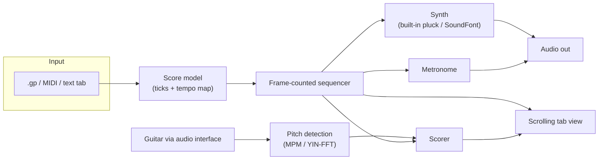

# guitarTutor
[](https://github.com/S95F/guitarTutor/actions/workflows/ci.yml)

Plug in your electric guitar. Load a piece. Practice it properly.

guitarTutor is an open-source guitar practice companion written in Go. You import a piece of music (or write one in a simple text format), and the app plays it back — synthesized from the score, with a metronome and scrolling tablature — while you play along on a real guitar plugged into your audio interface. Loop the hard bars, slow them down, and let the app ramp the tempo back up as you nail each pass. Later phases listen to your playing and tell you which notes you hit.

> **Status: Phases 1–4 core work, pre-alpha.** The practice player is functional; the app can hear you (`play -listen`: live pitch detection, hit/close/miss on the tab, a tuner, wait mode); and it now opens **Guitar Pro 7/8 `.gp`** and **MusicXML** files directly and plays **backing tracks** (WAV/FLAC/MP3) pinned to score time. Chords are now scored by verifying each expected note against the strum's spectrum. The importers are built clean-room against the documented formats and validated on a self-authored corpus, and detection thresholds are tuned on synthesized audio — real Guitar-Pro/MuseScore exports and real guitar recordings are the remaining validation gaps, so files and bug reports are gold. Next up is the app shell (Phase 5): today every piece and setting arrives as a command-line flag. See the [roadmap](ROADMAP.md) and [decisions](docs/DECISIONS.md).

## Why

The tools guitarists actually practice with are either editors that can't hear you (Guitar Pro, TuxGuitar), subscription apps with unreliable note detection (Yousician, the now-abandoned Rocksmith+), or web players that break mid-loop (Songsterr). Rocksmith 2014 was delisted in 2023 and Ubisoft closed its studio in January 2026 — there is a real vacuum for an **offline-first, no-subscription, import-your-own-music** practice tool.

guitarTutor aims to fill it with the practice loop every guitarist converges on:

1. Pick a section of the piece.
2. Loop it — gaplessly, or with a count-in before each pass.
3. Slow it down — without pitch change, since playback is synthesized from the score.
4. Ramp the tempo up automatically, pass by pass. Once the app can hear you (Phase 2), the ramp gates on accuracy instead of mere completion.
5. (Phase 2) Get honest, forgiving feedback on which notes you actually played.

## Planned features

**Phase 1 — practice player (no microphone needed)**

- Import Standard MIDI Files, or write pieces in a small text tab format. (Until Guitar Pro import lands in Phase 3, get your songs in by exporting MIDI from Guitar Pro, TuxGuitar, or MuseScore — MIDI loses fingering data, so the app infers fingerings and marks them as inferred.)
- Synthesized playback with scrolling tablature and a playback cursor — a built-in plucked-string voice out of the box, or any SoundFont you supply (`-sf2`)
- Sample-accurate A/B section looping, gapless or with optional count-in
- Tempo scaling (percentage or fixed BPM) with an automatic per-pass speed ramp
- Metronome (visual + audio), track mute/solo
- Single-binary Windows build, pure Go

**Phase 2 — the guitar plugs in**

- Live input from your audio interface (WASAPI, one duplex stream for input + playback)
- Monophonic pitch detection tuned for guitar (riffs, lines, solos, bends)
- Hit / close / miss feedback on the scrolling tab, per-section accuracy
- "Wait mode": playback pauses until you play the right note
- Tuner view, latency calibration wizard

**Phase 3 — real-world files (landed)**

- Guitar Pro 7/8 (`.gp`) and MusicXML (`.musicxml`/`.mxl`) import with authored fingerings
- Backing-track audio (WAV/FLAC/MP3) pinned to score time

**Phase 4 — chords and robustness (landed)**

- Expected-chord verification: every string of a strum scored, via chroma-template correlation against the notes the score expects — not blind transcription
- Palm-muted and damped notes credited for their attack instead of failed for an unclear pitch
- Optional SwiftF0 ONNX pitch backend behind a build tag (the default binary stays free of any runtime DLL)

**Phase 5 — the app shell (landed)**

- Start screen with recent pieces, native file-dialog opening, and drag-and-drop
- In-app settings: audio device pickers, latency calibration in-window, SoundFont, count-in
- Fixed-BPM entry, track solo, a help overlay, and live warnings surfaced in the UI

**Later (Phase 6 and beyond)**

- macOS and Linux ports
- An opt-in [note highway](docs/HIGHWAY.md) — notes approaching down string lanes, for when you want to read what's coming rather than read notation. The tab stays the default
- A [practice log](docs/PROGRESS.md) with streaks and badges, built so a detection error can never cost you either

See the full [ROADMAP](ROADMAP.md) for phasing, acceptance criteria, and explicit non-goals.

## How it will work



A few load-bearing design rules, distilled from research into why comparable apps succeed or fail (details in [docs/DECISIONS.md](docs/DECISIONS.md)):

- **The score is tick-based** (PPQ 960 + tempo map, SMF semantics). Wall-clock time is always derived, never stored — this is what makes looping, tempo scaling, and scoring drift-free.
- **One clock.** When live input arrives (Phase 2), capture and playback run in a single full-duplex audio callback so scoring timestamps and playback share a frame counter. That only truly holds when both run on the same physical interface — so the app steers you to plug headphones into the interface your guitar is plugged into, and treats split-device setups (which drift) as a case to detect, not ignore.
- **Synthesis is the primary playback path.** Tempo change is exact and free when the piece is rendered from the score; audio backing tracks are a secondary import.
- **Scoring is forgiving and optional.** Detection latency has a physics floor (~25–50 ms at low E's 82.4 Hz); feedback is scored against timing windows, never marketed as instant. Nothing blocks your practice if detection misfires.
- **Pure Go until it can't be.** Phase 1 builds with no C toolchain at all. cgo arrives with audio capture in Phase 2 — release builds require it from then on, but a pure-Go playback-only backend stays maintained for contributor and CI builds. ONNX (for ML pitch) remains optional behind a build tag.

## What you'll need

- An electric guitar and a USB audio interface (Focusrite Scarlett-class is plenty). Any interface with a clean DI signal works — no proprietary cable required. (A Rocksmith Real Tone cable enumerates as an ordinary USB capture device and should work for input — mono, no direct monitoring — though it's untested.)
- Use your interface's **direct monitoring** to hear yourself; the app deliberately does not software-monitor your guitar (the round-trip latency would be unpleasant).
- **Want your distorted tone while you practice?** Hardware modelers or pedals in front of the interface work transparently. Software amp sims can run alongside if your interface's driver is multi-client (common on Focusrite-class gear: your sim takes the ASIO path while the app captures via WASAPI shared mode). Either way, scoring works best on the clean DI signal — heavy distortion degrades pitch detection.
- Windows first; macOS and Linux are planned once the practice loop is solid.

## Building & running

Requires Go 1.26+. Phase 1 is pure Go — no C toolchain, no assets to download.

```bash
go build ./cmd/guitartutor
```

Run it with no arguments — or double-click the binary — and it opens the start screen: recent pieces, an Open button that browses with the system's own file dialog (filtered to the formats it imports), drag-and-drop onto the window, and settings (audio devices, latency calibration, SoundFont, count-in) without touching a terminal.

```bash
./guitartutor
```

Or go straight to a piece:

```bash
./guitartutor play testdata/fixture_riff.gtab
```

Or your own piece: `guitartutor play song.gp` — also `.mid`, `.musicxml`/`.mxl`, and `.gtab`. Useful flags: `-scale 0.7` start slowed down, `-countin 4`, `-met` metronome, `-sf2 your.sf2` SoundFont synthesis instead of the built-in pluck.

Play along with the original recording under the synth:

```bash
guitartutor play -backing song.flac -backing-offset 1.2 song.gp
```

The backing audio is pinned to score time, so looping and seeking stay aligned; slowing down pitch-shifts it (the synthesized parts stay pitch-true — no pure-Go time-stretch exists yet, a documented limitation). `-backing-offset` is the file position, in seconds, at the piece's first tick.

Legacy Guitar Pro formats (`.gp3`–`.gp5`, `.gpx`) aren't parsed directly — convert them once with free [MuseScore](https://musescore.org):

```bash
MuseScore4.exe song.gp5 -o song.musicxml
```

In the practice view: **space** play/pause, **←/→** seek by bar, **↑/↓** tempo ±5%, **shift+B** exact BPM, **A/B** set loop points at the current bar, **L** clear loop, **M** metronome, **R** progressive speed ramp, **C** count-in, **+/−** zoom, **1–9** mute tracks (**shift+1–9** solo), **T** tuner, **W** wait mode (live), **S** settings, **F5** re-open the piece, **esc** back, **Q** quit. Press **?** or **F1** on any screen for the full list.

The mouse works everywhere too: a transport bar and toggles across the top, a timeline under the tab showing where you are in the whole piece — click or drag it to move — and loop ends you can drag on either the tab or the timeline, snapping to the beat unless you hold shift. Click a track chip to mute it, right-click to solo it.

### Live mode — the guitar plugs in

```bash
guitartutor devices
```

lists your audio endpoints. Pick the interface your guitar is plugged into (a unique name fragment is enough), calibrate the round trip once, then practice with the app listening:

```bash
guitartutor calibrate -in scarlett -out scarlett
```

```bash
guitartutor play -listen -in scarlett -out scarlett testdata/fixture_riff.gtab
```

Notes you play are matched against the score: green = hit, amber = close (loose intonation, wrong octave, or a damped note whose attack landed but whose pitch never spoke), red = miss. **T** opens the tuner; **W** enables wait mode, which holds playback at each note until you actually play it.

**Chords are scored too — with a caveat worth reading.** The pitch tracker is monophonic, so rather than guess at a chord the app verifies the notes it already expects: each strum's pitch-class spectrum is checked against the expected chord, every string independently. Weak evidence is never a miss — a string the app can't clearly hear scores *close*, and a chord whose spectrum doesn't match convicts nobody. On synthesized chords across eight voicings and four strum speeds, correct playing produces a false miss on about 1% of strings, and no wrong chord scores a clean sweep of hits. But all of that is measured on **synthesized** guitar: chord scoring against a real instrument is unvalidated, and [ROADMAP.md](ROADMAP.md) lists the specific shapes that remain marginal. Heavy distortion degrades detection; feed the clean DI signal.

Live mode needs a cgo build (the default when a C compiler is present — on Windows install [mingw-w64](https://www.mingw-w64.org/) or build with [MSYS2](https://www.msys2.org/); if cgo builds misbehave in PowerShell, run the build from Git Bash). On Windows a `CGO_ENABLED=0` build still works fully as a playback-only practice player; on Linux and macOS Ebitengine itself needs cgo, so a C toolchain is required either way there.

There is also an offline renderer — useful for checking a piece without opening the UI:

```bash
./guitartutor render -o out.wav testdata/fixture_riff.gtab
```

To write your own pieces, see the [text tab format](docs/TEXTFORMAT.md).

## Non-goals

- **No Rocksmith `.psarc`/CDLC ingestion** — legally hazardous (Ubisoft issued a DMCA takedown against a similar project in 2026). Import your own Guitar Pro, MIDI, and MusicXML files instead.
- **No bundled songs or catalog** — licensing is how practice apps die.
- **No amp modeling** — use your amp sim of choice alongside; the app only needs your dry signal.
- **No dynamic difficulty** — slow-then-ramp at full difficulty is the practice loop that works.
- **No XP grind, no loss-framing streaks, no leaderboards.** A practice log and additive recognition are planned ([docs/PROGRESS.md](docs/PROGRESS.md)), built so that misses cannot subtract and the streak never reads a note verdict — a detection error must never cost you anything. This is a practice tool, not a retention funnel.
- **The 2D tab stays the primary view.** A perspective [note highway](docs/HIGHWAY.md) is planned as an opt-in second view, because reading tab transfers to reading real tab and that's worth keeping.
- **No subscriptions, ever.**

## Contributing

The project is at the "argue about the roadmap" stage — issues and discussion are very welcome, especially from guitarists who practice with existing tools and from anyone who has fought Go audio or DSP before. Start with [ROADMAP.md](ROADMAP.md) and [docs/DECISIONS.md](docs/DECISIONS.md). The two Phase 6 features have their designs written up ahead of the code, and both reverse an earlier non-goal — [docs/HIGHWAY.md](docs/HIGHWAY.md) and [docs/PROGRESS.md](docs/PROGRESS.md) are where to argue with them.

## License

[MIT](LICENSE)
