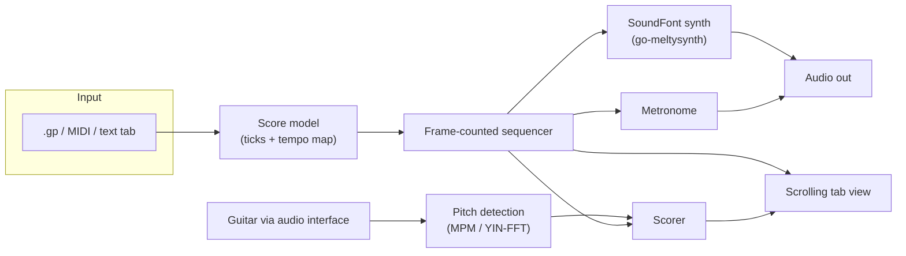

# guitarTutor

Plug in your electric guitar. Load a piece. Practice it properly.

guitarTutor is an open-source guitar practice companion written in Go. You import a piece of music (or write one in a simple text format), and the app plays it back — synthesized from the score, with a metronome and scrolling tablature — while you play along on a real guitar plugged into your audio interface. Loop the hard bars, slow them down, and let the app ramp the tempo back up as you nail each pass. Later phases listen to your playing and tell you which notes you hit.

> **Status: planning / pre-alpha.** The repository currently contains the project vision, a researched [roadmap](ROADMAP.md), and technology [decisions](docs/DECISIONS.md). There is no usable application yet.

## Why

The tools guitarists actually practice with are either editors that can't hear you (Guitar Pro, TuxGuitar), subscription apps with unreliable note detection (Yousician, the now-abandoned Rocksmith+), or web players that break mid-loop (Songsterr). Rocksmith 2014 was delisted in 2023 and Ubisoft closed its studio in January 2026 — there is a real vacuum for an **offline-first, no-subscription, import-your-own-music** practice tool.

guitarTutor aims to fill it with the practice loop every guitarist converges on:

1. Pick a section of the piece.
2. Loop it — gaplessly, or with a count-in before each pass.
3. Slow it down — without pitch change, since playback is synthesized from the score.
4. Ramp the tempo up automatically, pass by pass. Once the app can hear you (Phase 2), the ramp gates on accuracy instead of mere completion.
5. (Phase 2) Get honest, forgiving feedback on which notes you actually played.

## Planned features

**Phase 1 — practice player (no microphone needed)**

- Import Standard MIDI Files, or write pieces in a small text tab format. (Until Guitar Pro import lands in Phase 3, get your songs in by exporting MIDI from Guitar Pro, TuxGuitar, or MuseScore — MIDI loses fingering data, so the app infers fingerings and marks them as inferred.)
- SoundFont-synthesized playback with scrolling tablature and a playback cursor
- Sample-accurate A/B section looping, gapless or with optional count-in
- Tempo scaling (percentage or fixed BPM) with an automatic per-pass speed ramp
- Metronome (visual + audio), track mute/solo
- Single-binary Windows build, pure Go

**Phase 2 — the guitar plugs in**

- Live input from your audio interface (WASAPI, one duplex stream for input + playback)
- Monophonic pitch detection tuned for guitar (riffs, lines, solos, bends)
- Hit / close / miss feedback on the scrolling tab, per-section accuracy
- "Wait mode": playback pauses until you play the right note
- Tuner view, latency calibration wizard

**Later (Phases 3–5)**

- Guitar Pro 7/8 (`.gp`) and MusicXML import
- Expected-chord verification (chord scoring against the score, not blind transcription)
- Audio backing-track import (WAV/FLAC/MP3)
- macOS and Linux ports
- Optional ML pitch backend (SwiftF0 via ONNX) for noisy/distorted signals

See the full [ROADMAP](ROADMAP.md) for phasing, acceptance criteria, and explicit non-goals.

## How it will work



A few load-bearing design rules, distilled from research into why comparable apps succeed or fail (details in [docs/DECISIONS.md](docs/DECISIONS.md)):

- **The score is tick-based** (PPQ 960 + tempo map, SMF semantics). Wall-clock time is always derived, never stored — this is what makes looping, tempo scaling, and scoring drift-free.
- **One clock.** When live input arrives (Phase 2), capture and playback run in a single full-duplex audio callback so scoring timestamps and playback share a frame counter. That only truly holds when both run on the same physical interface — so the app steers you to plug headphones into the interface your guitar is plugged into, and treats split-device setups (which drift) as a case to detect, not ignore.
- **Synthesis is the primary playback path.** Tempo change is exact and free when the piece is rendered from the score; audio backing tracks are a secondary import.
- **Scoring is forgiving and optional.** Detection latency has a physics floor (~25–50 ms at low E's 82.4 Hz); feedback is scored against timing windows, never marketed as instant. Nothing blocks your practice if detection misfires.
- **Pure Go until it can't be.** Phase 1 builds with no C toolchain at all. cgo arrives with audio capture in Phase 2 — release builds require it from then on, but a pure-Go playback-only backend stays maintained for contributor and CI builds. ONNX (for ML pitch) remains optional behind a build tag.

## What you'll need

- An electric guitar and a USB audio interface (Focusrite Scarlett-class is plenty). Any interface with a clean DI signal works — no proprietary cable required. (A Rocksmith Real Tone cable enumerates as an ordinary USB capture device and should work for input — mono, no direct monitoring — though it's untested.)
- Use your interface's **direct monitoring** to hear yourself; the app deliberately does not software-monitor your guitar (the round-trip latency would be unpleasant).
- **Want your distorted tone while you practice?** Hardware modelers or pedals in front of the interface work transparently. Software amp sims can run alongside if your interface's driver is multi-client (common on Focusrite-class gear: your sim takes the ASIO path while the app captures via WASAPI shared mode). Either way, scoring works best on the clean DI signal — heavy distortion degrades pitch detection.
- Windows first; macOS and Linux are planned once the practice loop is solid.

## Building

Requires Go 1.26+.

```bash
go build ./cmd/guitartutor
```

This currently produces a stub binary — the project is in its planning phase.

## Non-goals

- **No Rocksmith `.psarc`/CDLC ingestion** — legally hazardous (Ubisoft issued a DMCA takedown against a similar project in 2026). Import your own Guitar Pro, MIDI, and MusicXML files instead.
- **No bundled songs or catalog** — licensing is how practice apps die.
- **No amp modeling** — use your amp sim of choice alongside; the app only needs your dry signal.
- **No dynamic difficulty, no 3D note highway, no XP/streak gamification** — slow-then-ramp at full difficulty on a 2D tab is the practice loop that works.
- **No subscriptions, ever.**

## Contributing

The project is at the "argue about the roadmap" stage — issues and discussion are very welcome, especially from guitarists who practice with existing tools and from anyone who has fought Go audio or DSP before. Start with [ROADMAP.md](ROADMAP.md) and [docs/DECISIONS.md](docs/DECISIONS.md).

## License

[MIT](LICENSE)
